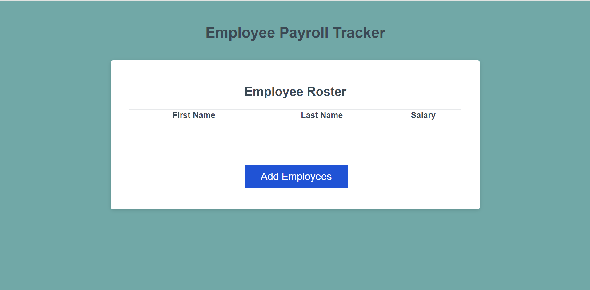

# A-Clever-Way-To-Calculate-Your-Pay
The purpose of this repository is to house an updated payroll tracker and log

# A-Clever-Way-To-Calculate-Your-Pay-Module-3

## Description
After going to the URL, a user will see an army green background before the header 'Employee Payroll Tracker' in dark bold lettering at the top-middle of the page. Below the heading is a long white box with 'Employee Roster' in dark bold lettering at the top. Directly beneath that is a thin, grey line sitting right above three evenly spaced titles: First Name, Last Name, Salary (respectively). There is a chunk of white space underneath the titles and then another thin grey line. A large blue button with 'Add Employee' in white lettering rests near the bottom of the box followed by a bit more white space.

## Details
The third module of the boot camp is to create a payroll tracker. The below bullets detail what was done to achieve this: 
- updated background color and title of page
- created empty array for user input
- updated function to grab user input with prompts detailing first/last names and salary
- updated function to add all employee salaries from the array and divide by number of employees to get avg
- updated function to write average salary calculation in console
- updated function to randomly pick from the array and write in the console [x] name

## Installation
N/A

## Usage
Users can utilize this source to calculate their employee's payroll and log their names and salaries. Users can also check the console for average salary information and a randomized employee name for whatever purpose.

## Credits
N/A

## Acknowledgements
N/A

[A Clever Way to Calculate Your Pay!](https://notsnowwhite.github.io/A-Clever-Way-To-Calculate-Your-Pay/) 

